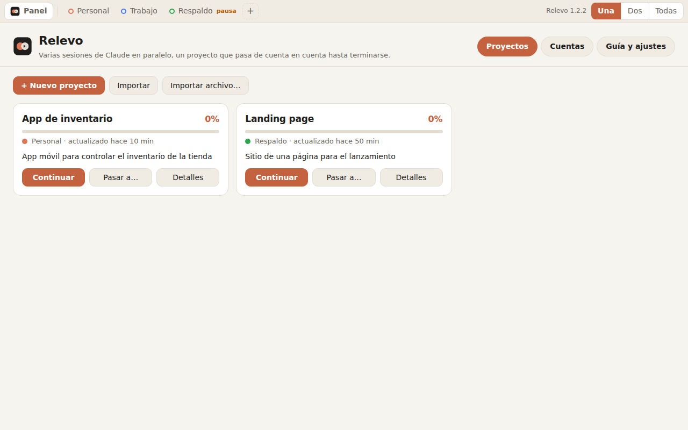
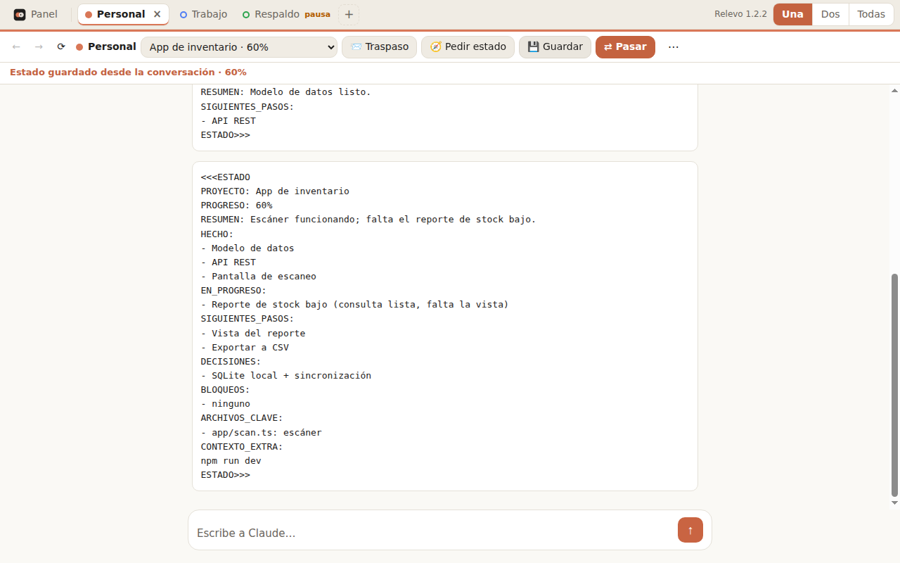
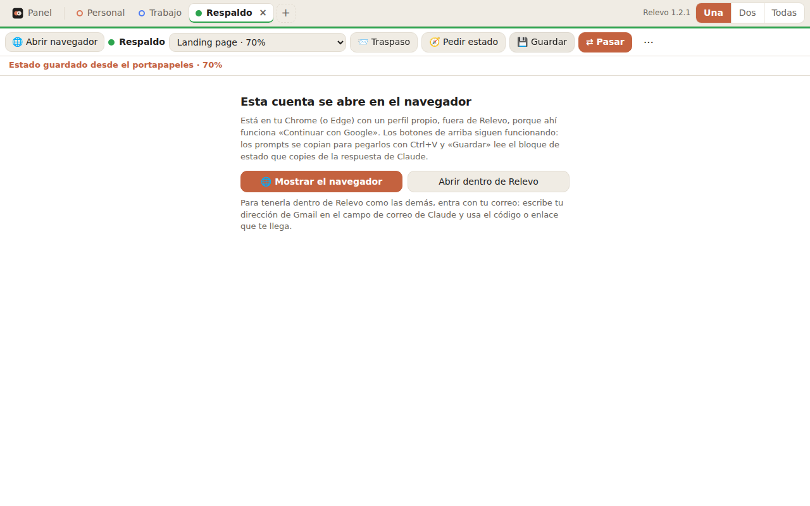
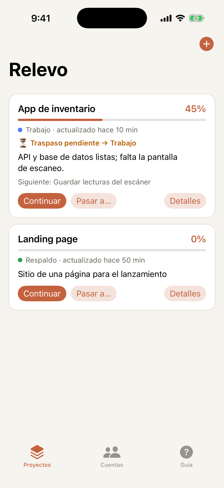
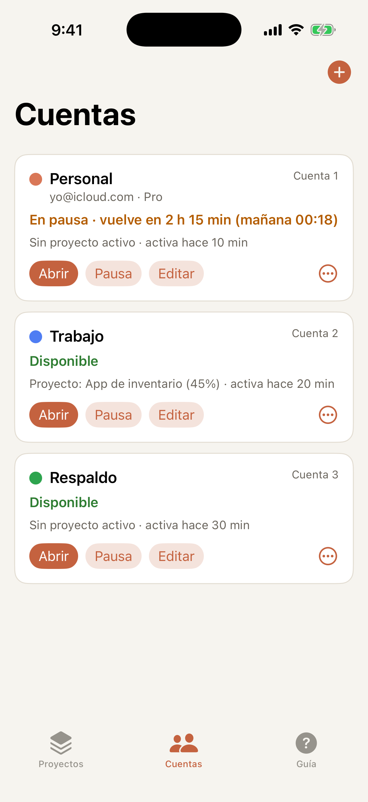
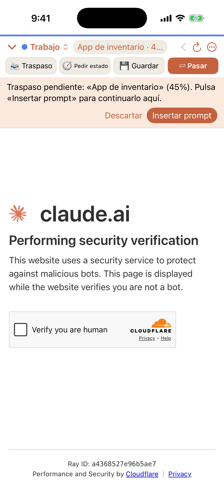
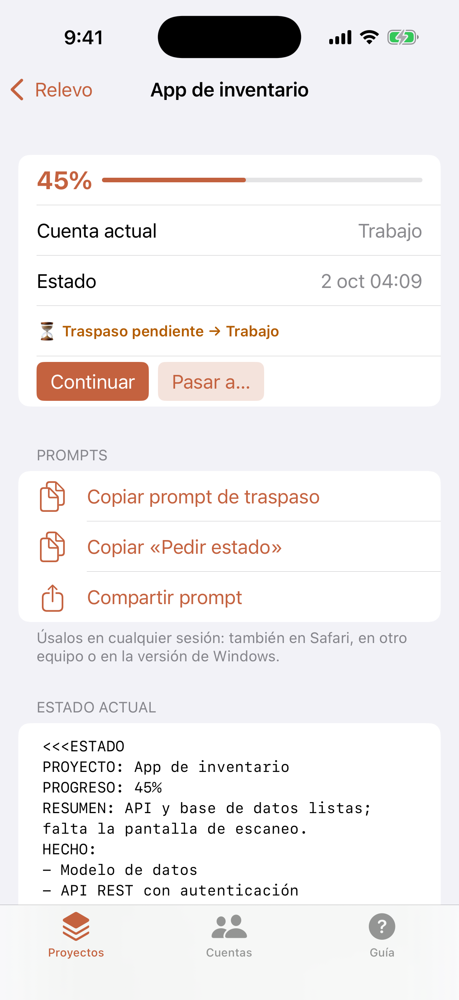
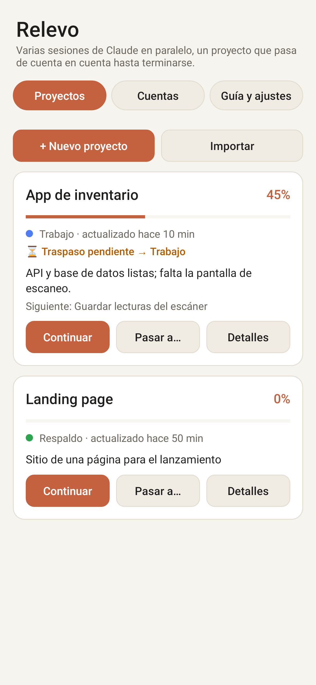
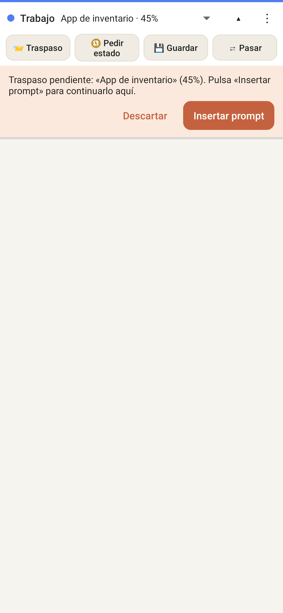
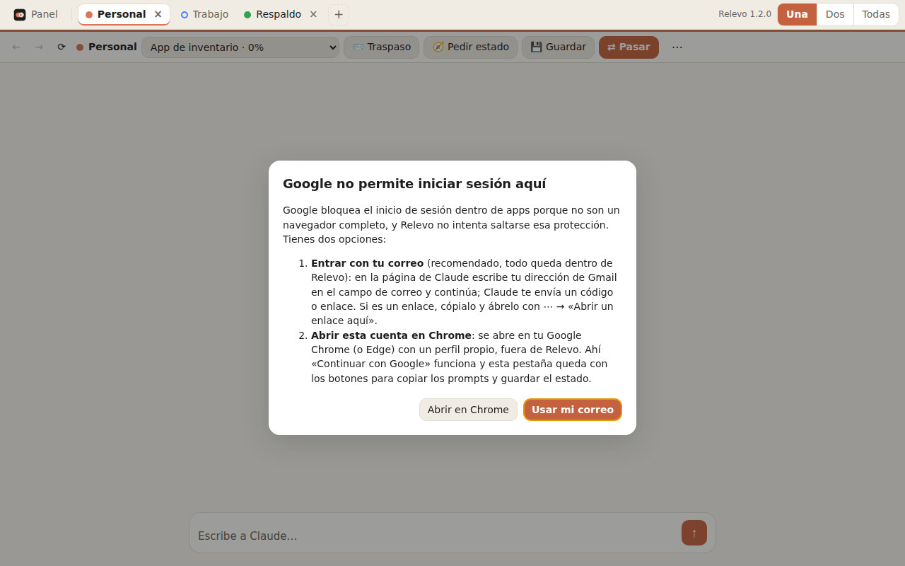

# Relevo

Trabaja con **varias sesiones de Claude a la vez, cada una con una cuenta distinta**, y **pasa un proyecto de una cuenta a otra** con todo su estado y avance hasta terminarlo.

- **Una ventana por cuenta, con la sesión aislada**: cada cuenta tiene sus propias cookies, así todas siguen iniciadas al mismo tiempo. En Windows, cada cuenta puede abrirse en **tu Google Chrome (o Edge) con un perfil propio**, donde «Continuar con Google» funciona.
- **Proyectos con estado**: objetivo, repositorio, indicaciones y el último **bloque de estado** (hecho, en progreso, siguientes pasos, decisiones, bloqueos, archivos clave y % de progreso), con historial de checkpoints y traspasos.
- **Traspaso entre cuentas**: pides el estado a Claude, lo guardas y lo pasas a otra cuenta; la ventana destino te deja el prompt de continuación listo en el cuadro de mensaje.
- **Pausas por límite**: marcas una cuenta en pausa y te avisa cuando vuelve a estar disponible.

## Descargas

| Plataforma | Archivo | Instalación |
|---|---|---|
| **Windows 10/11** (64 bits) | [`Relevo-Setup-1.1.0.exe`](https://github.com/Lancaster2995/Cloud1/releases/download/windows-v1.1.0/Relevo-Setup-1.1.0.exe) (instalador) o [`Relevo-1.1.0-portable.exe`](https://github.com/Lancaster2995/Cloud1/releases/download/windows-v1.1.0/Relevo-1.1.0-portable.exe) | [Ver abajo](#windows) |
| **iPhone / iPad** (iOS 17 o superior) | [`dist/Relevo.ipa`](dist/Relevo.ipa) o la [release de iOS](https://github.com/Lancaster2995/Cloud1/releases/tag/ios-v1.1.0) | [Ver abajo](#iphone-y-ipad-sin-mac) |
| **Android 10+** | [`dist/Relevo.apk`](dist/Relevo.apk) o la [release de Android](https://github.com/Lancaster2995/Cloud1/releases/tag/v1.1.0) | Abrir el APK y permitir «Instalar apps desconocidas» |

Los proyectos usan el mismo formato en las tres versiones: exporta el JSON en una (Detalles → Exportar / Compartir JSON) e impórtalo en otra (Proyectos → Importar).

### Windows

<p>
  
  
</p>

1. Descarga [`Relevo-Setup-1.1.0.exe`](https://github.com/Lancaster2995/Cloud1/releases/download/windows-v1.1.0/Relevo-Setup-1.1.0.exe) y ejecútalo (o usa la [versión portable](https://github.com/Lancaster2995/Cloud1/releases/download/windows-v1.1.0/Relevo-1.1.0-portable.exe), que no se instala). Si ya tenías la 1.0.0, se instala encima y conserva tus proyectos.
2. Como el ejecutable no está firmado, Windows puede mostrar «Windows protegió su PC»: pulsa **Más información → Ejecutar de todas formas**.
3. En **Cuentas → + Agregar cuenta** crea una por cada cuenta de Claude. En **Abrir con** elige:
   - **Navegador (Chrome o Edge) con un perfil propio** — para cuentas que entran con Google. Se abre tu Chrome real con un perfil separado solo para esa cuenta (no toca tu perfil habitual) y Relevo muestra encima una barra con los mismos botones.
   - **Ventana integrada de Relevo** — para entrar con tu correo.
4. Pulsa **Abrir** e inicia sesión una vez en cada cuenta.

**Organizar en mosaico** (`Ctrl+Shift+M`) reparte las ventanas en la pantalla, **Al lado** pone dos en mitades y `Ctrl+Shift+H` vuelve al panel principal.

<p>
  
</p>

### iPhone y iPad (sin Mac)

<p>
  
  
  
  
</p>

Apple no permite instalar apps fuera de la App Store sin firmarlas, así que el IPA se instala **desde tu PC con Windows usando tu Apple ID** (gratis) con Sideloadly:

1. En el PC instala **iTunes** y **iCloud** en su versión descargable de apple.com (no las de Microsoft Store) y luego **[Sideloadly](https://sideloadly.io)**.
2. Descarga [`dist/Relevo.ipa`](dist/Relevo.ipa), conecta el iPhone por cable y acepta «Confiar en este ordenador».
3. En Sideloadly arrastra el IPA, escribe tu Apple ID y pulsa **Start**.
4. En el iPhone: **Ajustes → General → VPN y gestión de dispositivos** → toca tu Apple ID → **Confiar**. En iOS 16 o superior activa también **Ajustes → Privacidad y seguridad → Modo de desarrollador** y reinicia.

Con un Apple ID gratuito la app **caduca a los 7 días**: vuelve a instalarla igual (se conservan tus datos) o usa **[AltStore](https://altstore.io)**, que la renueva sola por Wi‑Fi mientras el PC con AltServer esté encendido. Con una cuenta de desarrollador de Apple (de pago) dura un año.

En el iPhone las sesiones de todas las cuentas quedan abiertas: toca el nombre de la cuenta arriba para cambiar al instante. En iPad, ⋯ → **Abrir otra cuenta al lado** muestra dos a la vez.

### Android

<p>
  
  
</p>

Descarga [`dist/Relevo.apk`](dist/Relevo.apk) en el teléfono, ábrelo y permite «Instalar apps desconocidas». Cada cuenta abre su propia ventana (Recientes, pantalla dividida o DeX).

## Iniciar sesión con Google

Google **no permite** «Continuar con Google» dentro de ventanas integradas (WebView), porque no son un navegador completo, y Relevo no intenta saltarse esa protección. Si una ventana integrada intenta ir a Google, Relevo lo detiene y te explica las opciones:

- **Windows:** abre esa cuenta **en el navegador** (Cuentas → Editar → Abrir con: Navegador, o el botón «Abrir en Chrome» del aviso). Se usa tu Chrome o Edge real con un perfil propio para esa cuenta, y ahí Google funciona. En ese modo Relevo copia los prompts al portapapeles (pegas con `Ctrl+V`) y, para **Guardar**, copias la respuesta de Claude con el botón Copiar del bloque de código.
- **iPhone y Android:** entra **con tu correo**: escribe tu dirección de Gmail en el campo de correo de Claude y usa el código o enlace que te llega. Si es un enlace, cópialo y ábrelo con **⋯ → Abrir un enlace aquí** en la ventana de esa cuenta (si lo abres directamente, la sesión quedaría en el navegador del teléfono).

<p>
  
</p>

## Cómo se usa

1. **Cuentas**: agrega cada cuenta de Claude e inicia sesión una vez (ver [Iniciar sesión con Google](#iniciar-sesión-con-google)).
2. **Proyecto**: créalo con su objetivo (y repositorio, si hay código). **Continuar** abre la cuenta asignada, donde aparece el aviso para insertar el **prompt de inicio**.
3. **Barra de cada ventana**:

| Botón | Qué hace |
|---|---|
| 📨 **Traspaso** | Inserta el prompt de inicio (proyecto nuevo) o el de continuación con el último estado. En modo navegador abre un chat nuevo y copia el prompt para pegarlo. |
| 🧭 **Pedir estado** | Inserta (o copia, en modo navegador) el mensaje `CHECKPOINT`, que pide a Claude el bloque `<<<ESTADO … ESTADO>>>`. |
| 💾 **Guardar** | Lee el bloque más reciente de la conversación (o del portapapeles, en modo navegador) y lo guarda como checkpoint con su % de progreso. |
| ⇄ **Pasar** | Guarda el estado visible, eliges la cuenta destino y si pausar la actual; registra el traspaso y abre la otra cuenta. |

4. **Pasar el proyecto**: **Pedir estado** → envías → **Guardar** → **Pasar**. En la cuenta destino aparece **Traspaso pendiente → Insertar prompt**; envías y Claude continúa desde *SIGUIENTES_PASOS*. Repite hasta terminar. El historial (Detalles) muestra cada checkpoint y traspaso y permite restaurar un estado anterior.

Si el proyecto tiene repositorio, los prompts piden a Claude hacer commit y push de cada avance y mantener el mismo bloque en `HANDOFF.md`, así el estado viaja también con el código (ideal con Claude Code en `claude.ai/code`).

### Formato del bloque de estado

```
<<<ESTADO
PROYECTO: Tienda
PROGRESO: 45%
RESUMEN: Backend listo, falta el frontend.
HECHO:
- API de productos
EN_PROGRESO:
- Carrito (falta el total)
SIGUIENTES_PASOS:
- Terminar el carrito
DECISIONES:
- PostgreSQL por las transacciones
BLOQUEOS:
- ninguno
ARCHIVOS_CLAVE:
- api/server.ts: rutas
CONTEXTO_EXTRA:
npm run dev en el puerto 3000
ESTADO>>>
```

## Privacidad y límites

- Relevo **no envía mensajes ni automatiza Claude ni tu navegador**: solo coloca texto en el cuadro de mensaje cuando pulsas un botón (o lo copia), y tú decides enviarlo. A las ventanas de Chrome solo las abre.
- Todo se guarda solo en tu dispositivo; no hay servidores ni analítica.
- Usa solo tus propias cuentas y respeta los [Términos de uso de Anthropic](https://www.anthropic.com/legal/consumer-terms).
- Insertar texto en el chat depende de la página de claude.ai; si cambia, el texto queda copiado y lo pegas a mano.

## Código y compilación

| Carpeta | Versión | Tecnología | Compilar |
|---|---|---|---|
| `desktop/` | Windows | Electron: cada cuenta en Chrome/Edge con su propio `--user-data-dir`, o en una `BaseWindow` con partición `persist:relevo-sN` | `cd desktop && npm ci && npm test && npm run dist:win` |
| `ios/` | iPhone/iPad | SwiftUI + WKWebView con un `WKWebsiteDataStore(forIdentifier:)` por cuenta | `cd ios && xcodegen generate` y abrir en Xcode |
| `app/` | Android | Java + WebView, un proceso con `setDataDirectorySuffix` por cuenta | `./gradlew assembleRelease` |

GitHub Actions compila y prueba cada versión en cada push (`.github/workflows/`): pruebas unitarias en las tres, prueba de extremo a extremo con ventanas reales de Electron, pruebas de Robolectric en Android y pruebas en el simulador de iOS; además publica los instaladores como *Releases* y guarda las capturas en `docs/screens/`.

Sin Android SDK, `tools/build-local.sh` compila el APK usando solo artefactos de Maven Central y npm.
